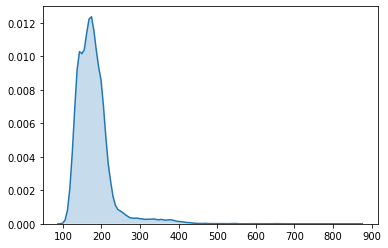

## Constant Time Benchmark

This repo is designed to test and validate various constant time algorithms in
various libraries/languages to ensure that there are no leaks.

Right now, most of the proof of concept code is in `benchmark.ipynb`.

## Golang Number Comparison Stats (standard implementation)

(Should be quicker)

```python
print(sns.kdeplot(dataset_0, shade=True))
```

    AxesSubplot(0.125,0.125;0.775x0.755)
    Mean 179.13993677555322
    Median 172.0
    Min 102.0
    Std 46.70515679933401




(Should take longer)

```python
print(sns.kdeplot(dataset_0, shade=True))
```
    Mean 181.5736945698738
    Median 175.0
    Min 102.0
    Std 47.23551601113846
    AxesSubplot(0.125,0.125;0.775x0.755)


Conclusion: It appears that there is little need for constant-time number comparisons in Golang as this already happens with numbers of the same size.

Note: Do not rely on this data alone. Variations in timing/attacks may exist on different devices, implementations, and versions of Golang. Always be cautious.


## License
See `LICENSE`
